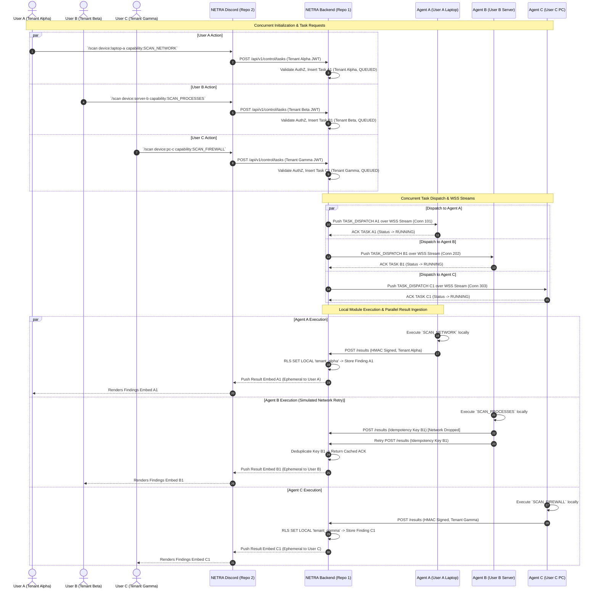
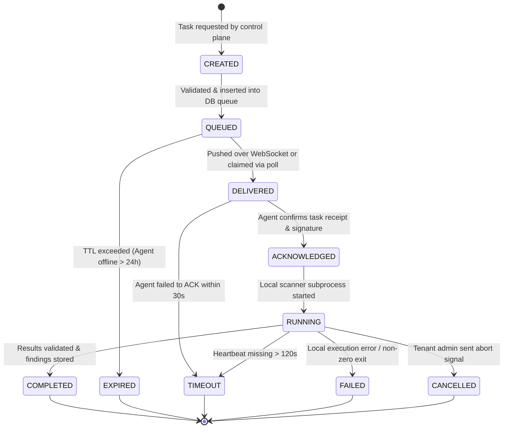
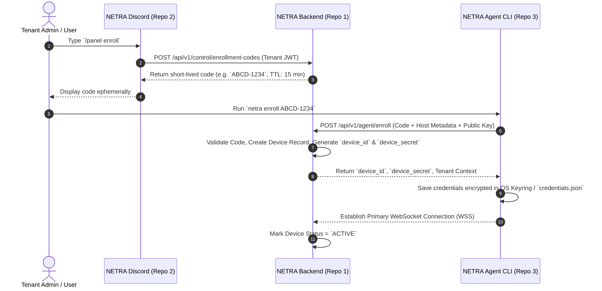

# NETRA System Design & Concurrency Architecture

## 1. Multi-User Concurrency Design Principles

NETRA is built from Day 1 to handle high-concurrency multi-tenant operations cleanly across 10+ simultaneous users, hundreds of enrolled agent devices, and concurrent Discord command triggers.

### 1.1 State Isolation Scopes Table

To guarantee that a failure or state corruption in User A's session never impacts User B, state is strictly scoped and decoupled from process-local global variables:

| Scope | Managed Entities | Storage / Lifecycle | Concurrency & Boundary Enforcement |
| :--- | :--- | :--- | :--- |
| **Shared Platform State** | Global DB Schema, Enum Definitions, Audit Vault | PostgreSQL 16 DB | Transaction isolation, Row-Level Security (`app.current_tenant_id`), ACID constraints. |
| **User-Scoped State** | User JWTs, `TenantMembership`, User Session | DB `user_sessions`, JWT payload | Cryptographically signed JWT claims; verified on every API request. |
| **Device-Scoped State** | `DeviceCredential`, Active WSS Connection | DB `device_credentials`, In-Memory WSS Connection Registry (`connectionId` mapped to `deviceId` + `tenantId`) | Isolated connection streams; disconnect on device A does not affect device B. |
| **Request-Scoped State** | `request_id`, `TenantContext`, Route Params | Node.js Fastify AsyncLocalStorage (`RequestStore`) | Immutable per-request object; created at Gateway entry, destroyed on HTTP/WSS response. |
| **Locking Boundaries** | Task Queue Claims (`QUEUED` $\rightarrow$ `DELIVERED`) | PostgreSQL `FOR UPDATE SKIP LOCKED` | Database-level row locking prevents duplicate task claims under concurrent polling/WSS pushes. |
| **Idempotency Boundaries** | Task Execution Results Ingestion | DB `task_executions` (`executionId` + `X-Idempotency-Key`) | Idempotent transaction guard; retried result submissions return cached ACK without duplicate writes. |
| **Queue Boundaries** | Pending Task Queue | PostgreSQL `tasks` table (`status = QUEUED`) | Multi-tenant compound index `(tenantId, status)`; tasks isolated per tenant slice. |

---

## 2. Three-User Simultaneous Execution Sequence Diagram

The following sequence diagram demonstrates **three independent users (User A, User B, User C)** operating concurrently across different tenants and devices without cross-tenant state leakage or queue blocking:



---

## 3. Directional Data & Control Flow

NETRA enforces strict directional isolation. The Discord Control Plane and NETRA Agents NEVER interact directly:

```
[ User in Discord ]
        │
        │ 1. /scan target:laptop-01 capability:SCAN_NETWORK
        ▼
[ NETRA Discord (Repo 2) ]
        │
        │ 2. POST /api/v1/control/tasks (Bearer Tenant JWT)
        ▼
[ NETRA Backend (Repo 1) ]
        │
        │ 3. Validate AuthZ & Queue Task (CREATED -> QUEUED)
        │ 4. Dispatch via WSS (Primary) or Poll Response (Fallback)
        ▼
[ NETRA Agent (Repo 3) ]
        │
        │ 5. Execute Approved Local Scanner Module
        │ 6. Send Signed Payload (HMAC SHA-256)
        ▼
[ NETRA Backend (Repo 1) ]
        │
        │ 7. Validate Signature, Idempotency, Store Findings & Audit
        │ 8. Emit Event Notification
        ▼
[ NETRA Discord (Repo 2) ]
        │
        │ 9. Render Ephemeral Visual Embed Output
        ▼
[ User in Discord ]
```

---

## 4. Explicit Task Lifecycle State Machine



### 4.1 State Definitions & Transition Rules

| State | Scope | Description & Trigger Conditions |
| :--- | :--- | :--- |
| `CREATED` | Backend | Task payload validated against schema; permissions verified against requesting tenant. |
| `QUEUED` | Backend DB | Transactionally persisted in PostgreSQL task queue; ready for agent dispatch. |
| `DELIVERED` | Transport | Pushed to active Agent WSS stream or returned in agent poll response. Lease clock starts. |
| `ACKNOWLEDGED`| Transport | Agent sends cryptographic ACK receipt (`X-Execution-ID`). Cancels delivery timeout timer. |
| `RUNNING` | Agent Host | Agent launched pre-compiled scanner module in isolated worker thread/subprocess. |
| `COMPLETED` | Backend DB | Terminal state. Results verified via HMAC, deduplicated, and committed to tenant findings vault. |
| `EXPIRED` | Backend DB | Terminal state. Task remained `QUEUED` past maximum TTL (default: 24 hours). |
| `TIMEOUT` | Backend DB | Terminal state. Agent stopped sending heartbeats or failed to report completion within lease window. |
| `FAILED` | Backend DB | Terminal state. Local scanner returned non-zero exit code or payload validation failed. |
| `CANCELLED` | Backend DB | Terminal state. Task aborted manually by authorized tenant administrator. |

---

## 5. Device Enrollment Architecture & Sequence


