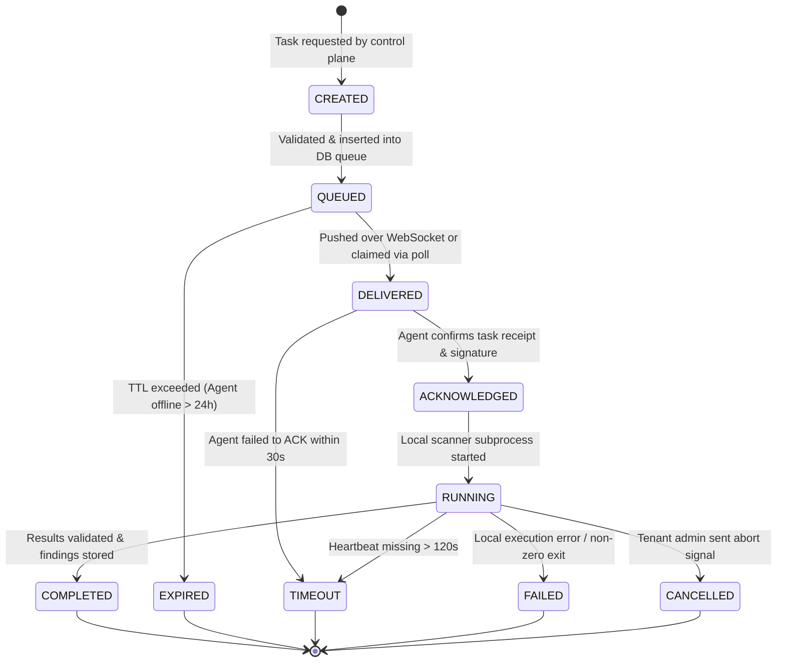
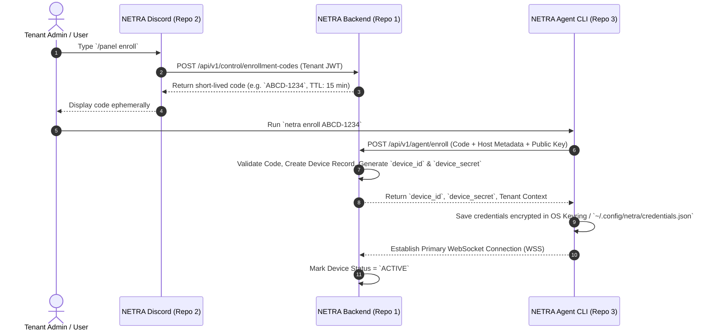

# NETRA System Design

## 1. Directional Data & Control Flow

NETRA enforces strict directional isolation. The Discord Control Plane and NETRA Agents NEVER interact directly:

```
[ User in Discord ]
        │
        │ 1. /scan target:laptop-01 module:SCAN_NETWORK
        ▼
[ NETRA Discord (Repo 2) ]
        │
        │ 2. POST /api/v1/control/tasks (Bearer Tenant JWT)
        ▼
[ NETRA Backend (Repo 1) ]
        │
        │ 3. Validate AuthZ & Queue Task (CREATED -> QUEUED)
        │ 4. Dispatch via WSS (Primary) or Poll Response (Fallback)
        ▼
[ NETRA Agent (Repo 3) ]
        │
        │ 5. Execute Approved Local Scanner Module
        │ 6. Send Signed Payload (HMAC SHA-256)
        ▼
[ NETRA Backend (Repo 1) ]
        │
        │ 7. Validate Signature, Idempotency, Store Findings & Audit
        │ 8. Emit SSE Event / Event Notification
        ▼
[ NETRA Discord (Repo 2) ]
        │
        │ 9. Render Ephemeral Visual Embed Output
        ▼
[ User in Discord ]
```

---

## 2. Explicit Task Lifecycle State Machine

To guarantee deterministic orchestration when 100+ concurrent scans occur simultaneously, every task adheres to a strict state machine with formal timeout and failure transitions.



### 2.1 State Definitions & Transition Rules

| State | Scope | Description & Trigger Conditions |
| :--- | :--- | :--- |
| `CREATED` | Backend | Task payload validated against schema; permissions verified against requesting tenant. |
| `QUEUED` | Backend DB | Transactionally persisted in PostgreSQL task queue; ready for agent dispatch. |
| `DELIVERED` | Transport | Pushed to active Agent WSS stream or returned in agent poll response. Lease clock starts. |
| `ACKNOWLEDGED`| Transport | Agent sends cryptographic ACK receipt (`X-Execution-ID`). Cancels delivery timeout timer. |
| `RUNNING` | Agent Host | Agent launched pre-compiled scanner module in isolated worker thread/subprocess. |
| `COMPLETED` | Backend DB | Terminal state. Results verified via HMAC, deduplicated, and committed to tenant findings vault. |
| `EXPIRED` | Backend DB | Terminal state. Task remained `QUEUED` past maximum TTL (default: 24 hours). |
| `TIMEOUT` | Backend DB | Terminal state. Agent stopped sending heartbeats or failed to report completion within lease window. |
| `FAILED` | Backend DB | Terminal state. Local scanner returned non-zero exit code or payload validation failed. |
| `CANCELLED` | Backend DB | Terminal state. Task aborted manually by authorized tenant administrator. |

---

## 3. Device Enrollment Architecture & Sequence

Device enrollment securely pairs a user's physical machine with their NETRA Tenant without embedding long-lived credentials in installers.



---

## 4. Idempotency & Retry Safety Model

To prevent duplicate findings or duplicate task executions caused by network retries, every task execution carries a tri-part correlation identity:

- **`task_id`**: Globally unique ID for the requested task.
- **`execution_id`**: Unique ID generated per execution attempt (changes on task retry).
- **`request_id`**: HTTP/WSS request tracing ID (generated per network payload).

### 4.1 Deduplication Logic on Result Ingestion
1. Agent submits task results containing `task_id`, `execution_id`, and `request_id` along with `X-Idempotency-Key` header (`task_id:execution_id`).
2. Backend checks PostgreSQL `task_executions` table:
   - If `execution_id` already exists with status `COMPLETED`, Backend returns `200 OK` with cached ack response without re-inserting findings.
   - If `execution_id` is new, Backend executes a database transaction: updates task status, inserts findings using fingerprint deduplication (`tenantId_fingerprint`), and creates audit event.
