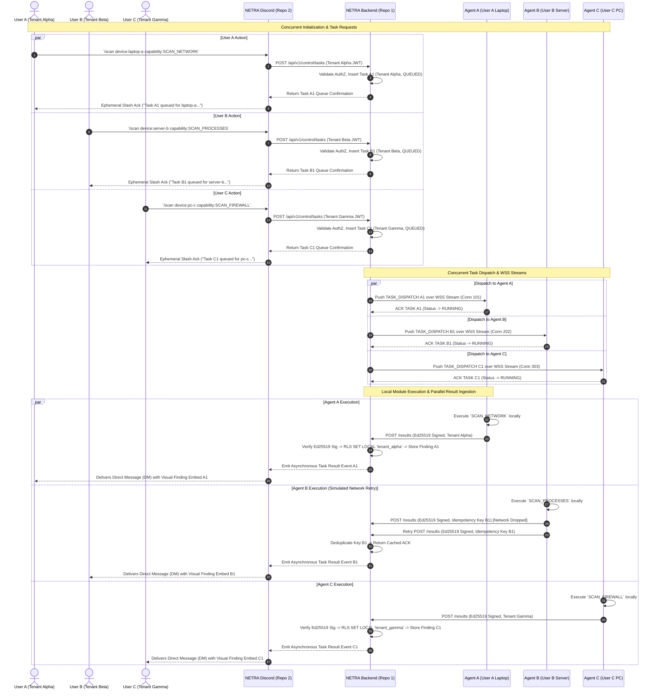
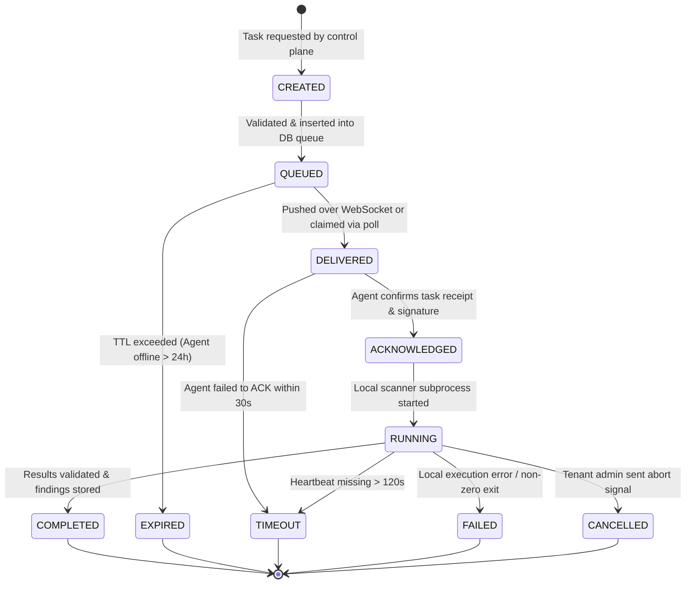
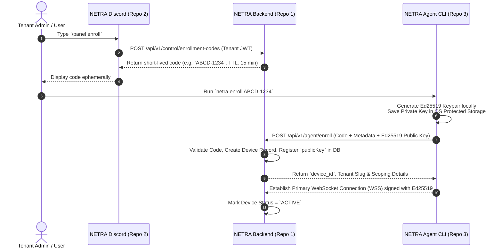

# NETRA System Design & Concurrency Architecture

## 1. Multi-User Concurrency Design Principles

NETRA is built from Day 1 to handle high-concurrency multi-tenant operations cleanly across 10+ simultaneous users, hundreds of enrolled agent devices, and concurrent Discord command triggers.

### 1.1 State Isolation Scopes Table

To guarantee that a failure or state corruption in User A's session never impacts User B, state is strictly scoped and decoupled from process-local global variables:

| Scope | Managed Entities | Storage / Lifecycle | Concurrency & Boundary Enforcement |
| :--- | :--- | :--- | :--- |
| **Shared Platform State** | Global DB Schema, Enum Definitions, Audit Vault | PostgreSQL 16 DB | Transaction isolation, Row-Level Security (`app.current_tenant_id`), ACID constraints. |
| **User-Scoped State** | User JWTs, `TenantMembership`, User Session | DB `user_sessions`, JWT payload | Cryptographically signed JWT claims; verified on every API request. |
| **Device-Scoped State** | `DeviceCredential` (Public Key), Active WSS Connection | DB `device_credentials`, In-Memory WSS Connection Registry (`connectionId` mapped to `deviceId` + `tenantId`) | Isolated connection streams; Ed25519 public key in DB; private key strictly in Agent OS protected storage. |
| **Request-Scoped State** | `request_id`, `TenantContext`, Route Params | Node.js Fastify AsyncLocalStorage (`RequestStore`) | Immutable per-request object; created at Gateway entry, destroyed on HTTP/WSS response. |
| **Locking Boundaries** | Task Queue Claims (`QUEUED` $\rightarrow$ `DELIVERED`) | PostgreSQL `FOR UPDATE SKIP LOCKED` | Database-level row locking prevents duplicate task claims under concurrent polling/WSS pushes. |
| **Idempotency Boundaries** | Task Execution Results Ingestion | DB `task_executions` (`executionId` + `X-Idempotency-Key`) | Idempotent transaction guard; retried result submissions return cached ACK without duplicate writes. |
| **Queue Boundaries** | Pending Task Queue | PostgreSQL `tasks` table (`status = QUEUED`) | Multi-tenant compound index `(tenantId, status)`; tasks isolated per tenant slice. |

---

## 2. Three-User Simultaneous Execution Sequence Diagram

The following sequence diagram demonstrates **three independent users (User A, User B, User C)** operating concurrently across different tenants and devices without cross-tenant state leakage or queue blocking, using Ed25519 signature validation and Ephemeral Ack + Direct Message (DM) result delivery:



---

## 3. Directional Data & Control Flow

NETRA enforces strict directional isolation. The Discord Control Plane and NETRA Agents NEVER interact directly:

```
[ User in Discord ]
        │
        │ 1. /scan target:laptop-01 capability:SCAN_NETWORK
        ▼
[ NETRA Discord (Repo 2) ]
        │
        │ 2. POST /api/v1/control/tasks (Bearer Tenant JWT)
        ▼
[ NETRA Backend (Repo 1) ] ── (3. Return Ephemeral Confirmation) ──> [ Discord ] ──> (4. Ephemeral Ack) ──> [ User ]
        │
        │ 5. Queue Task (CREATED -> QUEUED)
        │ 6. Dispatch via WSS (Primary) or Poll Response (Fallback)
        ▼
[ NETRA Agent (Repo 3) ]
        │
        │ 7. Execute Approved Local Scanner Module
        │ 8. Send Payload Signed with Local Ed25519 Private Key
        ▼
[ NETRA Backend (Repo 1) ]
        │
        │ 9. Verify Ed25519 Signature against DB Public Key, Check Idempotency, Store Findings & Audit
        │ 10. Emit Async Event Notification to Control Plane
        ▼
[ NETRA Discord (Repo 2) ]
        │
        │ 11. Render & Send Direct Message (DM) Embed Output
        ▼
[ User in Discord ]
```

---

## 4. Explicit Task Lifecycle State Machine



### 4.1 State Definitions & Transition Rules

| State | Scope | Description & Trigger Conditions |
| :--- | :--- | :--- |
| `CREATED` | Backend | Task payload validated against schema; permissions verified against requesting tenant. |
| `QUEUED` | Backend DB | Transactionally persisted in PostgreSQL task queue; ready for agent dispatch. |
| `DELIVERED` | Transport | Pushed to active Agent WSS stream or returned in agent poll response. Lease clock starts. |
| `ACKNOWLEDGED`| Transport | Agent sends cryptographic ACK receipt (`X-Execution-ID`). Cancels delivery timeout timer. |
| `RUNNING` | Agent Host | Agent launched pre-compiled scanner module in isolated worker thread/subprocess. |
| `COMPLETED` | Backend DB | Terminal state. Results verified via Ed25519 public key, deduplicated, committed to tenant findings vault, and emitted for async Discord DM delivery. |
| `EXPIRED` | Backend DB | Terminal state. Task remained `QUEUED` past maximum TTL (default: 24 hours). |
| `TIMEOUT` | Backend DB | Terminal state. Agent stopped sending heartbeats or failed to report completion within lease window. |
| `FAILED` | Backend DB | Terminal state. Local scanner returned non-zero exit code or payload validation failed. |
| `CANCELLED` | Backend DB | Terminal state. Task aborted manually by authorized tenant administrator. |

---

## 5. Device Enrollment Architecture & Sequence



---

## 6. Multi-Tenant Concurrency Matrix & Fault Recovery Architecture

NETRA explicitly handles 10 real-world concurrency scenarios and system restart edge cases to ensure data isolation, idempotency, and zero state corruption:

### 6.1 Scenario 1: 3 Users / Same Tenant
- **Behavior**: User A, User B, User C belong to Tenant Alpha and trigger concurrent scans.
- **Handling**: Tasks are inserted under `tenantId = tenant_alpha`. Database RLS scopes queries to `tenant_alpha`. PostgreSQL row locks (`FOR UPDATE SKIP LOCKED`) prevent workers from double-claiming tasks. All 3 users see results for Tenant Alpha devices, delivered to each requesting user via personal Discord DM.

### 6.2 Scenario 2: 3 Users / Different Tenants
- **Behavior**: User A (Tenant Alpha), User B (Tenant Beta), User C (Tenant Gamma) dispatch tasks simultaneously.
- **Handling**: Strict tenant boundary isolation. Fastify `AsyncLocalStorage` sets `app.current_tenant_id` per request transaction. PostgreSQL RLS prevents cross-tenant data visibility. Zero shared memory or global state leakage between tenants.

### 6.3 Scenario 3: Multiple Devices / Same User
- **Behavior**: User A triggers `/scan` across `device-01`, `device-02`, and `device-03` at the same time.
- **Handling**: Backend creates 3 distinct `Task` records (`task_01`, `task_02`, `task_03`). Each task is dispatched to the corresponding device's WSS stream independently. Results are processed in parallel and delivered as separate DMs to User A.

### 6.4 Scenario 4: Simultaneous Commands Processing
- **Behavior**: Rapid burst of 50 incoming Discord slash commands within 1 second.
- **Handling**: Non-blocking Node.js async event loop handles REST API requests. Fastify processes incoming HTTP tasks asynchronously, validating Zod schemas and inserting `QUEUED` task rows in bulk database transactions.

### 6.5 Scenario 5: Simultaneous Task Results Ingestion
- **Behavior**: 20 agents post scan results (`POST /api/v1/agent/tasks/:id/results`) simultaneously.
- **Handling**: Each result ingestion request runs inside a dedicated database transaction with `SET LOCAL app.current_tenant_id`. Ed25519 signatures are verified in parallel using Node's `crypto.verify`. Findings are bulk-inserted with `ON CONFLICT DO NOTHING` for deduplication.

### 6.6 Scenario 6: Duplicate Deliveries & Network Retries
- **Behavior**: Agent posts scan results, but network drops before receiving HTTP 200 ACK. Agent retries posting identical result payload.
- **Handling**: Ingestion endpoint validates `X-Idempotency-Key: task_id:execution_id`. The compound unique constraint `@@unique([taskId, executionId])` in `TaskExecution` detects duplicate submissions, skips redundant finding writes, and returns the cached HTTP 200 ACK.

### 6.7 Scenario 7: WSS Disconnections & Automatic Reconnection
- **Behavior**: Flaky network disconnects Agent WSS stream during idle state.
- **Handling**: Agent detects WSS closure, initiates exponential backoff reconnect (1s, 2s, 4s, 8s... max 60s) with jitter. During WSS outage, Agent polls fallback REST endpoint `GET /api/v1/agent/tasks` every 15s. Upon WSS reconnect, Agent signs WSS handshake with Ed25519 private key and resumes real-time stream.

### 6.8 Scenario 8: Backend Service Restart & Task Recovery
- **Behavior**: `netra-backend` container restarts while tasks are in `QUEUED` or `DELIVERED` state.
- **Handling**: State machine recovery job executes on Backend startup. Tasks stuck in `DELIVERED` without an ACK past lease expiration (30s) are reset to `QUEUED`. Connected agents automatically reconnect WSS streams and re-fetch pending tasks.

### 6.9 Scenario 9: Discord Bot Service Restart
- **Behavior**: `netra-discord` container restarts while user commands are in flight.
- **Handling**: Discord gateway automatically resumes session using session ID and sequence number. The bot re-registers slash commands if needed. Ongoing task execution in Backend is completely unaffected because task state is persisted in PostgreSQL, not in Discord bot memory. When results complete, Backend emits event and Discord bot sends DMs upon reconnect.

### 6.10 Scenario 10: Agent Host Restart & Local Worker Recovery
- **Behavior**: User PC reboots or agent process crashes while task is in `RUNNING` state.
- **Handling**: On agent startup, `netra-agent` daemon checks its encrypted local SQLite queue buffer. Unfinished local scanner executions are marked `FAILED` or retried depending on task parameters. If execution timed out on Backend (>120s missing heartbeat), Backend marks task `TIMEOUT`. Next status check informs the user.
